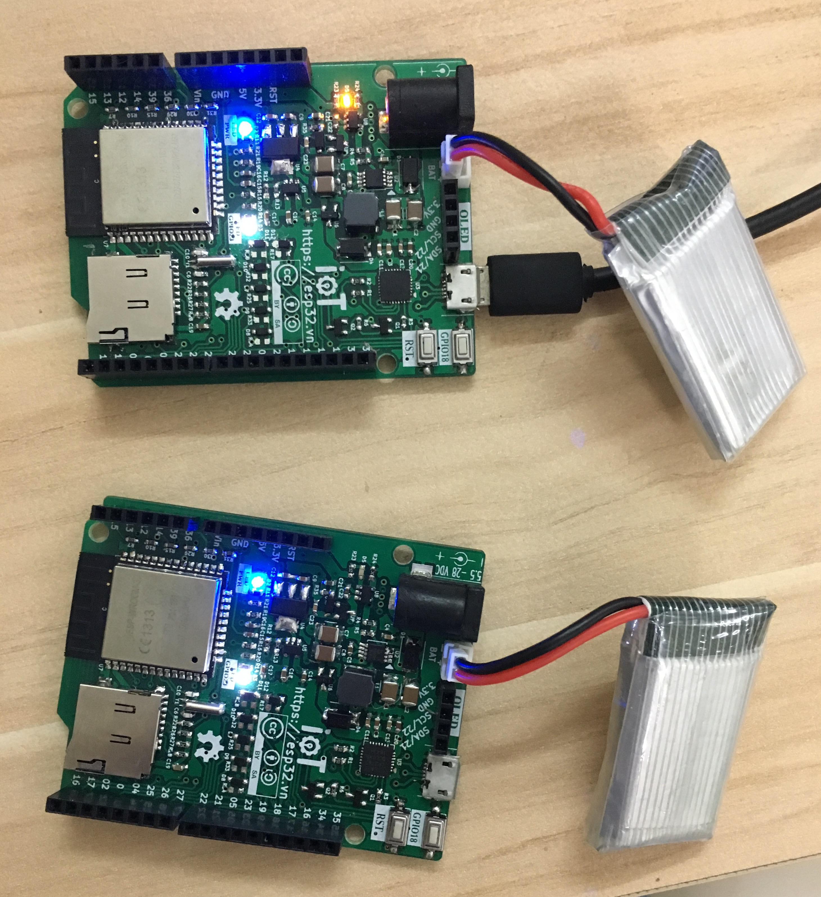
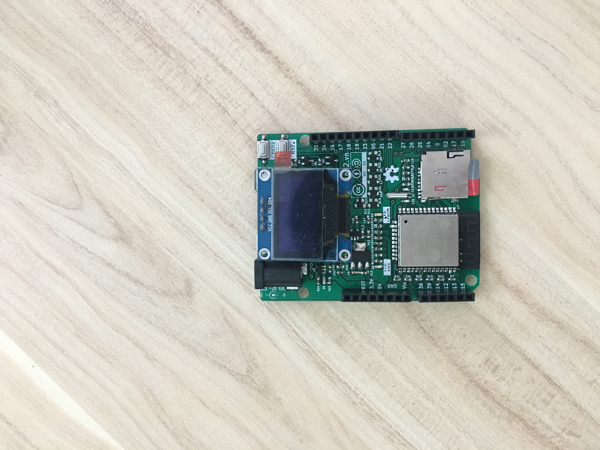
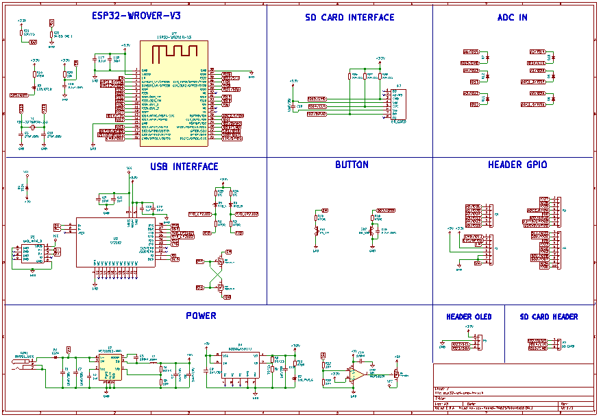
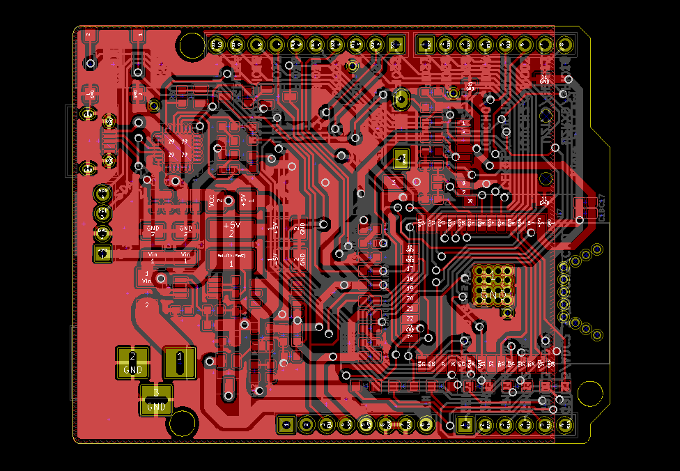
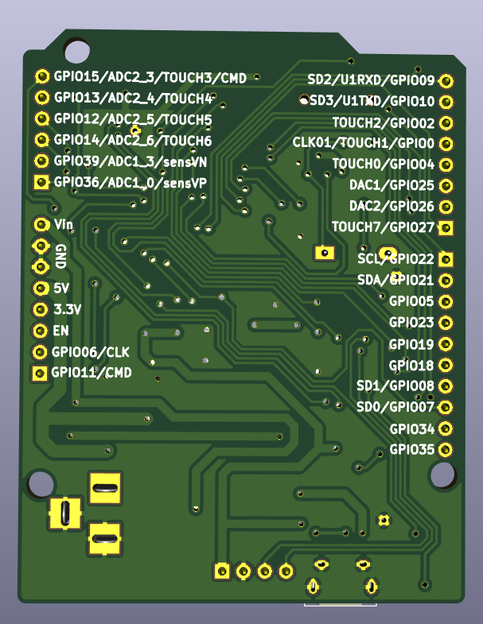

# esp32-iot-uno 

## Hardware features

- ESP32 WiFi, Bluetooth LE SoC - 240Mhz - Module ESP-WROOM-32
- Automatic select 3 power sources (DC6-28V, USB and Battery)
- Auto download Flash mode
- Integrated SDCARD slot (support 1-bit mode)
- Open hardware design with KiCad, CC-BY-SA license.
- I2C OLED display header 
- Lithium-Ion Battery Charger
- 1 Reset button, 1 programable button
- 1 Power LED, 1 programable LED, 1 Charger LED 
- Compatible with Shields for ESP32 in the future (Gateway - GSM/GPRS/GPS and Lora Shield, Connectivity - CAN, RS485, RS232 Shield, Audio Shield, ...)

### Images

### Pinout:

### Schematic

### PCB

### 3D

#### TOP

#### DOWN

### Gerber

[Download](./assets/gerber.zip)

### License

- CC-BY-SA 
- This creative commons license requires you to release all derivative works under this same license. You must give credit to the original author of the work, state their name and the title of the original work, say that you modified the work if you did and include the attribution logo, website: https://esp32.vn
